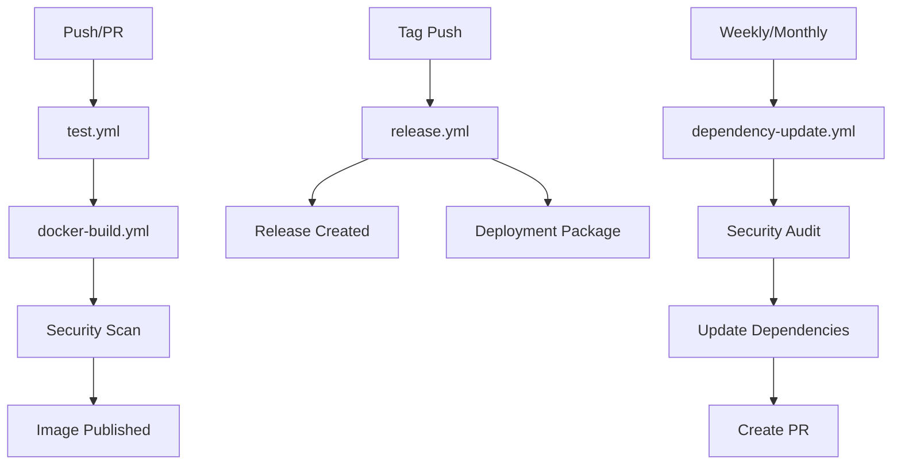

# GitHub Actions Workflows

This directory contains GitHub Actions workflows for automated CI/CD, testing, and deployment of the GitHub Smart application.

## 📋 Workflows Overview

### 1. **test.yml** - Application Testing
- **Trigger**: Push to main/develop branches, Pull Requests
- **Purpose**: Run comprehensive tests before building Docker images
- **Features**:
  - PHP syntax validation
  - Composer dependency validation
  - Database integration tests
  - Basic application functionality tests
  - Security vulnerability scanning
  - Test artifact upload

### 2. **docker-build.yml** - Docker Build & Publish
- **Trigger**: Push to main/develop branches, Pull Requests, Tags
- **Purpose**: Build and publish Docker images to GitHub Container Registry
- **Features**:
  - Multi-platform builds (linux/amd64, linux/arm64)
  - Automated tagging based on git refs
  - Security scanning with Trivy
  - Image testing and validation
  - GitHub Security tab integration

### 3. **release.yml** - Release Management
- **Trigger**: Push of version tags (v*)
- **Purpose**: Create releases with deployment packages
- **Features**:
  - Automated release creation
  - Deployment package generation
  - Checksum verification
  - Multi-platform Docker images
  - Release notes generation

### 4. **dependency-update.yml** - Dependency Management
- **Trigger**: Weekly schedule (Monday 9 AM UTC), Manual dispatch
- **Purpose**: Automated dependency updates and security scanning
- **Features**:
  - Weekly security audits
  - Automated dependency updates
  - Pull request creation for updates
  - Security vulnerability reporting

## 🚀 Workflow Execution Order



## 🔧 Configuration

### Environment Variables
The workflows use the following environment variables:
- `GITHUB_TOKEN`: Automatically provided by GitHub
- `REGISTRY`: Set to `ghcr.io` (GitHub Container Registry)
- `IMAGE_NAME`: Set to `${{ github.repository }}`

### Required Secrets
- `GITHUB_TOKEN`: Automatically available in GitHub Actions
- No additional secrets required for basic functionality

### Permissions
The workflows request the following permissions:
- `contents: read` - Read repository contents
- `packages: write` - Publish to GitHub Container Registry
- `contents: write` - Create releases and upload assets

## 📦 Docker Image Tags

The Docker image is tagged with the following patterns:
- `latest` - Latest build from main branch
- `v1.2.3` - Specific version tags
- `v1.2` - Major.minor version
- `v1` - Major version
- `main` - Branch name
- `develop` - Branch name
- `pr-123` - Pull request number

## 🔒 Security Features

### Vulnerability Scanning
- **Trivy**: Container image vulnerability scanning
- **Composer Audit**: PHP dependency security scanning
- **GitHub Security Tab**: Integration with GitHub's security features

### Security Headers
- Non-root container user
- Security headers in Apache configuration
- Input validation and sanitization
- SQL injection protection

## 📊 Monitoring and Logs

### Workflow Artifacts
- Test results and logs
- Security audit reports
- Build artifacts
- Deployment packages

### Log Retention
- Test artifacts: 7 days
- Security audit results: 30 days
- Build cache: Managed by GitHub Actions

## 🛠️ Manual Triggers

### Manual Workflow Dispatch
```bash
# Trigger dependency update manually
gh workflow run dependency-update.yml

# Trigger test workflow manually
gh workflow run test.yml

# Trigger Docker build manually
gh workflow run docker-build.yml
```

### Release Creation
```bash
# Create a new release
git tag v1.2.3
git push origin v1.2.3
```

## 🔍 Troubleshooting

### Common Issues

1. **Build Failures**
   - Check PHP syntax: `find . -name "*.php" -exec php -l {} \;`
   - Verify composer.json: `composer validate --strict`
   - Check Docker build context

2. **Test Failures**
   - Verify MySQL service is running
   - Check environment variables
   - Review application logs

3. **Security Scan Issues**
   - Update dependencies: `composer update`
   - Review vulnerability reports
   - Check for outdated packages

4. **Docker Build Issues**
   - Verify Dockerfile syntax
   - Check multi-platform build support
   - Review build cache

### Debug Commands

```bash
# Check workflow status
gh run list

# View workflow logs
gh run view --log

# Download artifacts
gh run download

# Check container registry
gh registry list
```

## 📈 Performance Optimization

### Build Optimization
- Multi-stage Docker builds
- Build cache utilization
- Parallel job execution
- Dependency caching

### Resource Usage
- Ubuntu runners with 2-core CPU
- 7GB RAM available
- 14GB SSD storage
- 6-hour job timeout

## 🔄 Continuous Integration

### Pre-commit Checks
- PHP syntax validation
- Composer dependency validation
- Code formatting checks

### Post-commit Actions
- Automated testing
- Docker image building
- Security scanning
- Deployment package creation

## 📚 Related Documentation

- [GitHub Actions Documentation](https://docs.github.com/en/actions)
- [Docker Buildx Documentation](https://docs.docker.com/buildx/)
- [GitHub Container Registry](https://docs.github.com/en/packages/working-with-a-github-packages-registry)
- [Trivy Security Scanner](https://aquasecurity.github.io/trivy/)

## 🤝 Contributing

When adding new workflows or modifying existing ones:

1. **Follow naming conventions**: Use descriptive names with `.yml` extension
2. **Add documentation**: Update this README for new workflows
3. **Test locally**: Use `act` for local testing
4. **Security review**: Ensure no secrets are exposed
5. **Performance**: Optimize for speed and resource usage

## 📞 Support

For workflow-related issues:
1. Check the workflow logs in GitHub Actions
2. Review the troubleshooting section
3. Create an issue with workflow logs attached
4. Contact the maintainers for urgent issues 